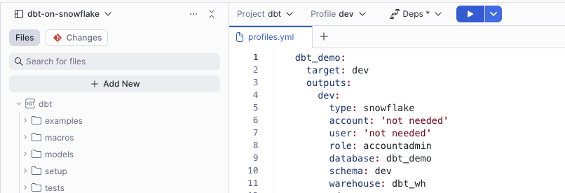
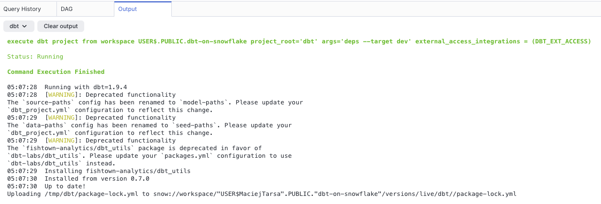

# Running dbt on Snowflake

We've seen dbt being run manually from local cli, in dbt cloud, using cosmos in managed airflow as well as in CI/CD pipelines. But Snowflake just introduces another way to run it natively on their platform, with their new Workspaces feature and git integration. Let's give it a go.

But why is it important? We've had client who were using Apache Airflow exlusivelt for orchestrating dbt workloads. We've had client who started with using CI/CD pipelines, but will eventually need to move into a more advanced orchestrator. In both cases while other compute is used for the orchestration, the meat of the compute is happening in Snowflake. Having an ability to run dbt natively on Snowflake could be a game changer for these workloads - completely removing the need to spend money and resources on other compute.

## Displaimer around dbt fushion

The timing on this new feature introduction in Snowflake is interesting. Very recently, dbt introduced dbt fushion, potentially discontinuing dbt core all together. This could be risky for anyone migrating their dbt core orchestration onto Snowflake.

## Setup

### dbt project

The most likely use case is that we will be bringing in an existing dbt project into Workspaces - hence we're going to use a sample dbt project with some existing models - Snowflake provides [a sample dbt projects that can be used](https://github.com/Snowflake-Labs/getting-started-with-dbt-on-snowflake). We're going to copy the contents of `tasty_bytes_dbt_demo` directory into our `dbt` directory for Snowflake to pick them up.

Same as in that repo, we'll have 2 environments - `dev` and `prod`. We'll assume that until now, we have been running this project somewhere else, be it an Airflow instance or manual calls from CLI.

### Snowflake Requirements

Workspaces are currently in preview in Snowflake. Preview features will need to be enabled on your account. To check the status of your account, run
```sql
SELECT SYSTEM$GET_PREVIEW_ACCESS_STATUS();
-- and to enable it
SELECT SYSTEM$ENABLE_PREVIEW_ACCESS();
```
[More info about preview features](https://docs.snowflake.com/en/release-notes/preview-features)

Workspaces for dbt Projects also require Personal databases to be enabled, this can be done by ACCOUNTADMIN role through running a command
```sql
ALTER ACCOUNT SET ENABLE_PERSONAL_DATABASE = TRUE;
-- or for specific user only
ALTER USER "USERNAME" SET ENABLE_PERSONAL_DATABASE = TRUE;
```

Secondary roles access are another requirement, this can be abled for a user
```sql
ALTER USER "USERNAME" SET DEFAULT_SECONDARY_ROLES = ('ALL');
```

Importantly, if your account has a session policy whcih disabled use of secondary roles, you will not have access to Workspaces. I got stuck on this for a while, as the errors returned from Snowflake weren't very descriptive.

Another requirements are related to git integration - a secret if your repository is private and api integration object.
```sql
CREATE OR REPLACE SECRET git_secret
  TYPE = password
  USERNAME = 'git_username'
  PASSWORD = 'git_token';

CREATE OR REPLACE API INTEGRATION git_api_integration
  API_PROVIDER = git_https_api
  API_ALLOWED_PREFIXES = ('https://github.com/my-account')
  ALLOWED_AUTHENTICATION_SECRETS = (dbt_demo.integrations.git_secret)
  ENABLED = TRUE;
```

Finally, if you require any dbt packages, a network rule and external access integration will be required.

```sql
CREATE OR REPLACE NETWORK RULE dbt_network_rule
  MODE = EGRESS
  TYPE = HOST_PORT
  -- Minimal URL allowlist that is required for dbt deps
  VALUE_LIST = (
    'hub.getdbt.com',
    'codeload.github.com'
    );

CREATE OR REPLACE EXTERNAL ACCESS INTEGRATION dbt_ext_access
  ALLOWED_NETWORK_RULES = (dbt_network_rule)
  ENABLED = TRUE;
```

While you could now create a git repository, there is currently to programmatically create a workspace and connect it to an existing git repository object. Hence the next step needs to be done in the UI.


## Working example

dbt commands can be executed in the UI by selecting one of your profiles and commands from the drop down.

You can then inspect the outputs in the Outputs tab



### Running and scheduling

You can use EXECUTE DBT PROJECT command from a Snowflake warehouse to run dbt commands like `test` and `run`, these can also be scheduled as tasks. Worth noting is that the new Adaptive Warehouse can be used for dbt execution.

### Observability and alers

## Considerations and limitations

It's worth noting that a dbt project is a schema level object and it support role-based access control (RBAC)

Workspaces are currently scoped to a user level. This means that you cannot create a git repository with dbt project in a shared database so that multiple users have access to it - they would all needs to create them individually in their workspaces.  There is also currenrtly no programmatic way to create workspaces - they can only be created in the UI.

Working with git un Snowflake UI is quite painful at the start. It's not quite as advanced as other Git tools - there's also no support for using the command line, so you are left with buttons for pushing, pulling, commiting, etc. Running the git commands is also quite slow, even adding a commit to a branch took a few seconds.

## Conclusions


Workspaces docs: https://docs.snowflake.com/en/user-guide/ui-snowsight/workspaces
dbt projects on Snowflake docs: https://docs.snowflake.com/en/user-guide/data-engineering/dbt-projects-on-snowflake
dbt projects on Snowflake getting starter tutorial: https://docs.snowflake.com/en/user-guide/data-engineering/dbt-projects-on-snowflake-getting-started-tutorial