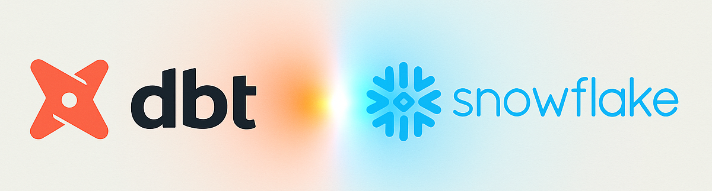
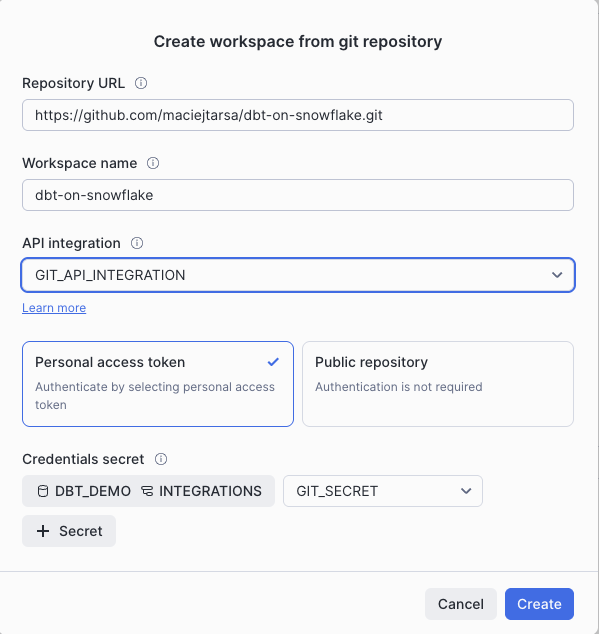
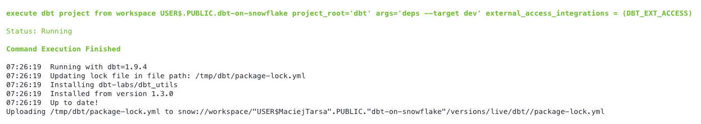
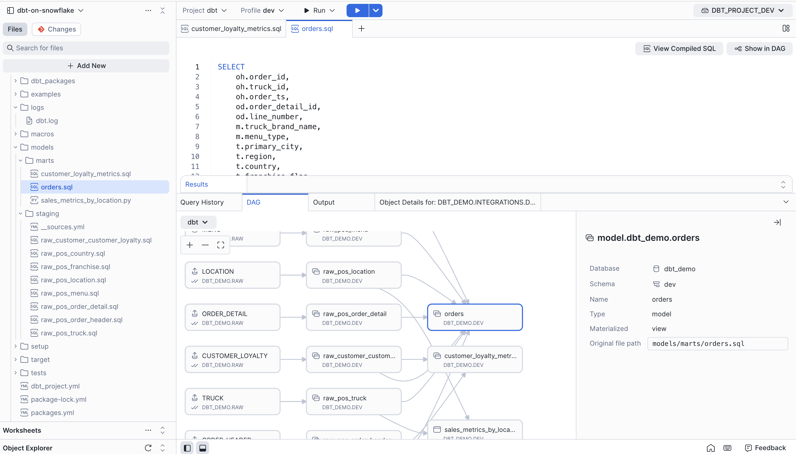
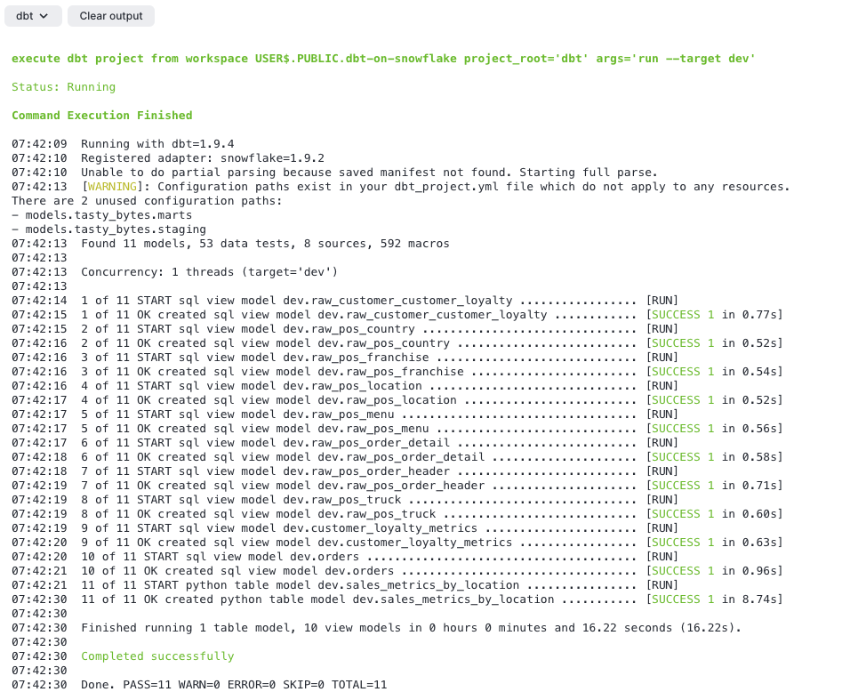
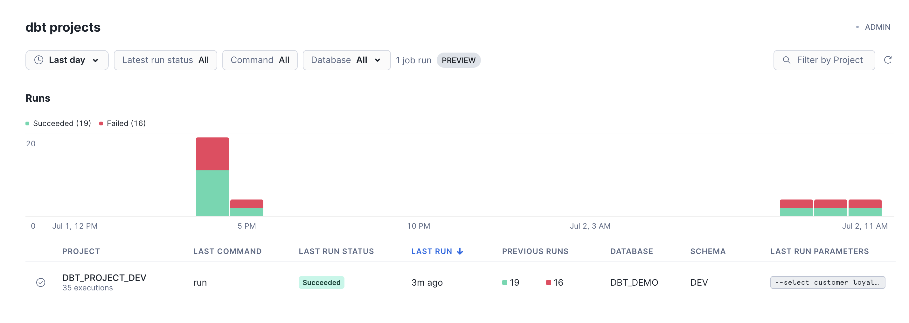

# dbt-on-Snowflake

This repository contains a sample project for running dbt on Snowflake.  The accompanying blog post is included below.

Article first published on Mechanical Rock website [TODO]  
Another version was also published on Medium [TODO]

# Running dbt on Snowflake

<p align="center">
  
</p>

We've seen dbt being run manually from the local CLI, in dbt Cloud, using Cosmos in managed Airflow, using databricks tasks, as well as in CI/CD pipelines. But Snowflake just introduced another way to run it natively on their platform - with their new Workspaces feature and Git integration. Let's give it a go.

But why is it important? We've had clients who used Apache Airflow exclusively for orchestrating dbt workloads, and others who started with CI/CD pipelines but eventually needed to move to a more advanced orchestrator. In both cases, while another tool is used for the orchestration of the dbt workload, the bulk of the compute happens in Snowflake. Having the ability to run dbt natively on Snowflake could be a game changer for these workloads - completely removing the need to spend money and resources on other compute.

## Disclaimer about dbt Fusion

The timing of this new feature introduction in Snowflake comes shortly after dbt Labs announced dbt Fusion - a new Rust-based engine for dbt transformations. There is currently a lot of confusion about what this means for dbt Core customers, with some speculation about the potential discontinuation of dbt Core altogether. While there is some risk in investing in the migration of dbt Core orchestration, dbt Labs has stated that there will be no changes to dbt Core’s license, support, or maintenance. For specific details, please refer to the [dbt Licensing FAQ](https://www.getdbt.com/licenses-faq).

## Setup

### dbt project

The most likely use case is bringing an existing dbt project into Workspaces. For this reason, we'll use a sample dbt project with some existing models. Snowflake provides [a sample dbt project](https://github.com/Snowflake-Labs/getting-started-with-dbt-on-snowflake) that can be used. We're going to copy the contents of the `tasty_bytes_dbt_demo` directory into our `dbt` directory for Snowflake Git integration to pick them up.

Apart from some name changes, we will keep it almost the same as in the sample repo. One notable difference is that we want to access a private Git repository, so we will need a secret object that stores our GitHub API credentials. As in the sample repo, we will have two environments - `dev` and `prod`. We will assume that, until now, we have been running this project somewhere else, such as in an Airflow instance or through manual calls from the CLI.

### Snowflake Requirements

Workspaces are currently in preview in Snowflake. Preview features will need to be enabled on your account using the `ACCOUNTADMIN` role.
```sql
-- To check the status of your account settings for preview access
SELECT SYSTEM$GET_PREVIEW_ACCESS_STATUS();
-- To enable preview features
SELECT SYSTEM$ENABLE_PREVIEW_ACCESS();
```
For more information on accessing preview features, check out [Snowflake Documentation](https://docs.snowflake.com/en/release-notes/preview-features).

Workspaces for dbt Projects also require Personal databases to be enabled. This can be done using the `ACCOUNTADMIN` role.
```sql
-- to enable personal database on account level
ALTER ACCOUNT SET ENABLE_PERSONAL_DATABASE = TRUE;
-- or for specific user only
ALTER USER "USERNAME" SET ENABLE_PERSONAL_DATABASE = TRUE;
```

Secondary roles access is another requirement. This can be enabled for a user
```sql
ALTER USER "USERNAME" SET DEFAULT_SECONDARY_ROLES = ('ALL');
```

Importantly, if your account has a session policy which disables use of secondary roles, you will not have access to Workspaces. I got stuck on this for a while, as the errors returned from Snowflake were not very descriptive.

Other requirements are related to Git integration - a secret if your repository is private - and an API integration object.
```sql
-- replace the values with your username and Git API token
CREATE OR REPLACE SECRET git_secret
  TYPE = password
  USERNAME = 'git_username'
  PASSWORD = 'git_token';

-- replace the url with your Git account
CREATE OR REPLACE API INTEGRATION git_api_integration
  API_PROVIDER = git_https_api
  API_ALLOWED_PREFIXES = ('https://github.com/my-account')
  ALLOWED_AUTHENTICATION_SECRETS = (dbt_demo.integrations.git_secret)
  ENABLED = TRUE;
```

Finally, if you require any dbt packages, a network rule and external access integration will be required.
```sql
-- add additional URLs if required
CREATE OR REPLACE NETWORK RULE dbt_network_rule
  MODE = EGRESS
  TYPE = HOST_PORT
  -- Minimal URL allowlist that is required for dbt deps
  VALUE_LIST = (
    'hub.getdbt.com',
    'codeload.github.com'
    );

CREATE OR REPLACE EXTERNAL ACCESS INTEGRATION dbt_ext_access
  ALLOWED_NETWORK_RULES = (dbt_network_rule)
  ENABLED = TRUE;
```

While you could now create a Git repository programmatically, there is currently no programmatic way to create a Workspace and connect it to an existing Git repository object. Hence, the next step needs to be done in the UI.

<p align="center">
  
</p>

*Figure 1: Snowflake User Interface for creating a Workspace*  

In order to use the sample Git repo from Snowflake, we also need some sample data. Instructions on how to create and load it can be found in [the sample dbt project repo](https://github.com/Snowflake-Labs/getting-started-with-dbt-on-snowflake) or [the Git repo for this article](https://github.com/maciejtarsa/dbt-on-snowflake/tree/main/setup).

## Working example

dbt commands can be executed in the UI by selecting your project (based on directory), profile (based on your `profiles.yml` file), and dbt command from the drop-downs.
<p align="center">
  
</p>

*Figure 2: Running dbt commands*  

You can then inspect the outputs in the Outputs tab. Here's an example of running `dbt deps`.
<p align="center">
  
</p>

*Figure 3: Output of running `dbt deps`*  

Equally, we can run `dbt compile`. As this command will produce a manifest, we will be able to inspect our dbt models visually on the DAG view.
<p align="center">
  
</p>

*Figure 4: Output of running `dbt deps`*  

Selecting a model in the DAG view also opens the source code for that model and highlights the file in the file tree, which is quite useful.
<p align="center">
  
</p>

*Figure 5: Dag view of compiled project*

Unfortunately, selecting a lot of the models leaves us with a lot of open tabs in the editor, and they each need to be closed manually.

Anyway - time to run the models. The output is your standard `dbt run` output.
<p align="center">
  
</p>

*Figure 6: `dbt run` output*  

This is all well and good - we can run dbt in our personal Workspace, which is the equivalent of running it from your laptop.  
Deployment is the next step. We need to deploy our dbt project from our Workspace -vthis will create a dbt project object. That object can then be used to schedule, run, and monitor a dbt project outside of the Workspace. It's worth noting that a dbt project is a schema-level object and it supports role-based access control (RBAC).

This operation can either be done in the UI, or with the following Snowflake command:
```sql
CREATE OR REPLACE DBT PROJECT DBT_DEMO.DEV.DBT_PROJECT_DEV
	FROM snow://workspace/"USER$MaciejTarsa".PUBLIC."dbt-on-snowflake"/versions/live/dbt/;
```
What's interesting is that we're creating it from a specific user's Workspace. It would be interesting to see how multiple users can collaborate on a project at the same time, or better yet, if service accounts can be used for this purpose.

### Running and scheduling

Ok, now that we have a dbt project object, let's create a task that will execute it. The new `EXECUTE DBT PROJECT` command is helpful here. It can also be paired with arguments to specify models or dbt commands to run.

In the following example, we will schedule a dbt run in dev for a single model to run every hour at 5 minutes past the hour.
```sql
CREATE OR REPLACE TASK dbt_demo.dev.run_prepped_data_dbt
        WAREHOUSE=dbt_wh
        SCHEDULE ='USING CRON 5 * * * * UTC'
      AS
  EXECUTE DBT PROJECT DBT_PROJECT_DEV ARGS='run --select customer_loyalty_metrics --target dev';
  ALTER TASK dbt_demo.dev.run_prepped_data_dbt RESUME;
```
Note that a task can also be created in the UI of the Workspace from your dbt project. The task that runs the `EXECUTE DBT PROJECT` command needs to be in the same database and schema as the dbt project object.

### Observability and alerts

An important aspect of working with dbt is the ability to monitor and inspect task execution - including drilling down to individual tasks and alerting relevant teams when model runs fail. I'm interested in understanding what Snowflake offers to support those needs.

dbt projects now have their own monitoring dashboard:
<p align="center">
  
</p>

*Figure 7: dbt monitoring dashboard*  

We can drill down on any individual run where we can see dbt output and telemetry tracing.
<p align="center">
  
</p>

*Figure 8: dbt monitoring output*  

<p align="center">
  
</p>

*Figure 9: dbt monitoring traces*  

dbt run results are saved by Snowflake and can be exported to a named internal stage for further analysis if required.
Apart from that - as we are using tasks here - all the usual Snowflake observability and monitoring can be used. For example, you could create a task which will monitor your dbt execution, and attach an alert that would notify of any failures.

## Considerations and limitations

Workspaces are currently scoped to a user level. This means that you cannot create a Git repository with a dbt project in a shared database so that multiple users can collaborate on it - they would all need to create them individually in their Workspaces. Think of Workspaces like your individual environments. There is also currently no programmatic way to create Workspaces - they can only be created in the UI. 

Working with Git in the Snowflake UI is quite painful at the start. It's not quite as advanced as other Git tools - there's also no support for using the command line. If you are used to running Git from the command line, this will feel very clunky to you - you are left with buttons for pushing, pulling, committing, etc. Running the Git commands is also quite slow; even adding a commit to a branch took a few seconds.

While the way you deploy a project as an object and schedule it with tasks is nice, I can see issues when multiple users deploy the same project simultaneously from their individual Workspaces. We need some way to deploy it from CI/CD - from the main branch only after the changes have been inspected and approved - not from individual users' Workspaces. I expect having a service user's Workspace would work here, but at the moment you cannot create a dbt project Workspace programmatically, so someone would still need to log into the UI as that service user.

However, there is still a route to develop and test the models locally, but deploy and run them in higher environments directly in Snowflake. We just need to be able to deploy them from a Workspace that is not linked to any particular user.

## Conclusions

Overall, this is a very interesting development and one worth watching and considering. There are some nice things here - not having to use additional tools for your dbt runs or dbt results integration with native Snowflake monitoring. There are some critical parts missing though - especially having to use an individual user's Workspace for deployment. Nevertheless, if your stack contains tools whose only job is to run dbt, fully switching to Snowflake is definitely worth considering, and doing some experimentation based on your workload might be a good idea.

We'd love an excuse to try all of this in practice. If you have a use case that could benefit from running dbt on Snowflake, [let us know](https://www.mechanicalrock.io/lets-get-started)!

Some useful links to learn more:
- [Snowflake Workspaces documentation](https://docs.snowflake.com/en/user-guide/ui-snowsight/workspaces)
- [dbt projects on Snowflake](https://docs.snowflake.com/en/user-guide/data-engineering/dbt-projects-on-snowflake)
- [dbt projects on Snowflake getting started tutorial](https://docs.snowflake.com/en/user-guide/data-engineering/dbt-projects-on-snowflake-getting-started-tutorial)

## License
Copyright 2025 Mechanical Rock

Licensed under the Apache License, Version 2.0 (the "License");
you may not use this file except in compliance with the License.
You may obtain a copy of the License at

    http://www.apache.org/licenses/LICENSE-2.0

Unless required by applicable law or agreed to in writing, software
distributed under the License is distributed on an "AS IS" BASIS,
WITHOUT WARRANTIES OR CONDITIONS OF ANY KIND, either express or implied.
See the License for the specific language governing permissions and
limitations under the License.
